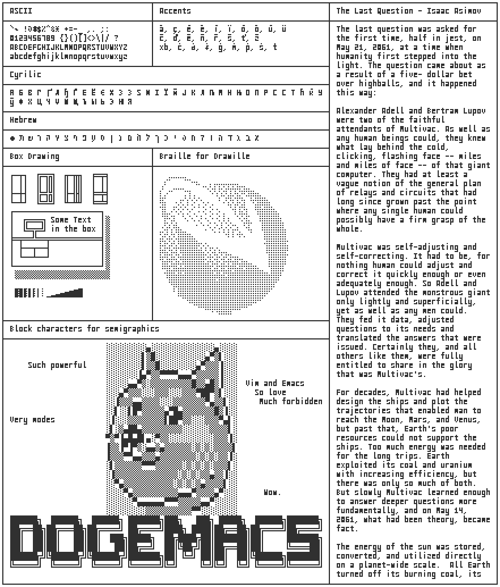
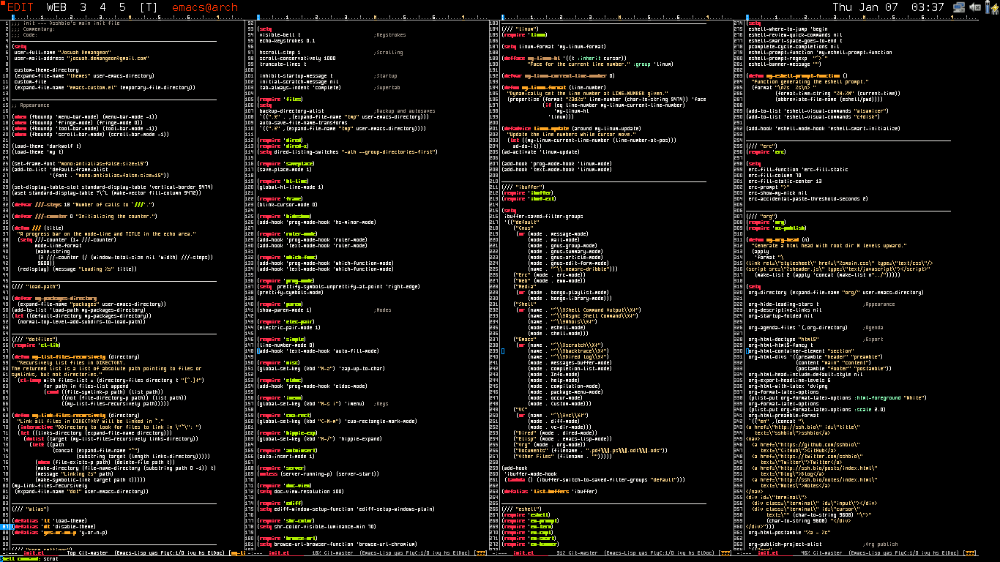

Miniwi font
================================================================================

This is a font in a 8x4 format (including spaces), made from scratch, but with
inspiration from the [tom
thumb](http://robey.lag.net/2010/01/23/tiny-monospace-font.html) font (thank
you, Robey!).



On a 320x240 raspberry screen, it can display 80x30 (2400) characters.

Then on my laptop screen...



It support the characters from these encodings:

- ASCII characters (easy!)
- ISO 8859-{1, 2, 3, 4, 9, 10, 13, 14} (Latin 0 to 8)
- ISO 8859-5 and KOI8-R (Cyrilic) 
- ISO 8859-6 (Arabic)
- ISO 8859-7 (Greek)
- ISO 8859-8 (Hebrew)

... as well as box-drawing characters, all braille characters to make
it suitable for [drawille](https://github.com/asciimoo/drawille) and
mincellaneous symbols (math, punctuation, all circled numbers and
letters ...).

More?
--------------------------------------------------------------------------------

I have mosts of the glyph I need, and if you want some more, ask me
and I may add them!

Contributions are welcome as well.

Build
--------------------------------------------------------------------------------

The psf tty font is generated by the bdf-to-psf (aka bdf2psf) script.
Ask me if you want explainations, I wauld be glad to explain.

Otherwise, I build the font with fontforge and maybe some day I will switch to
gbdfed.

To generate the font set comments from the characters code, I used
this emacs macro:

```elisp
(setq last-kbd-macro
   "\C-f\C-f\C-@\C-e\C-[w # \C-u\C-[:(char-to-string #x\C-y)\C-m\C-?\C-b\C-?\C-u\C-x=\C-xo\C-[ssE\C-?C-x 8\C-s\C-m\C-f\C-@\C-e\C-b\C-[wq\C-y\C-d\C-a\C-n")
```

And this vim macro using the unicode.vim plugin:

``` VimL
nnoremap <leader>c I# U+<esc>lyeA:   <esc>"=unicode#UnicodeName(0x<c-f>pA)
```
